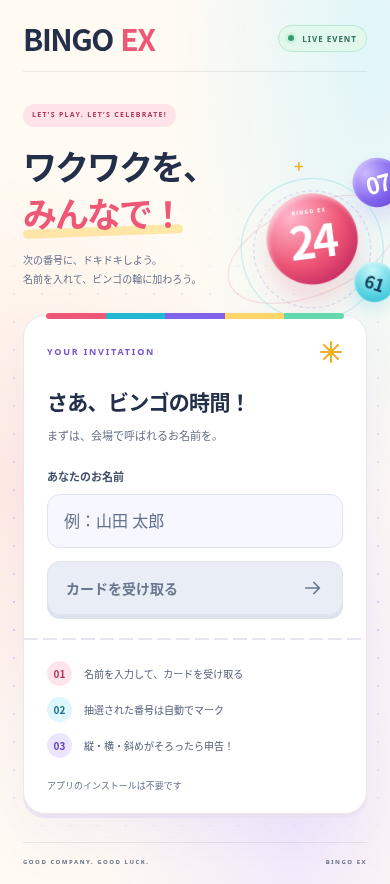
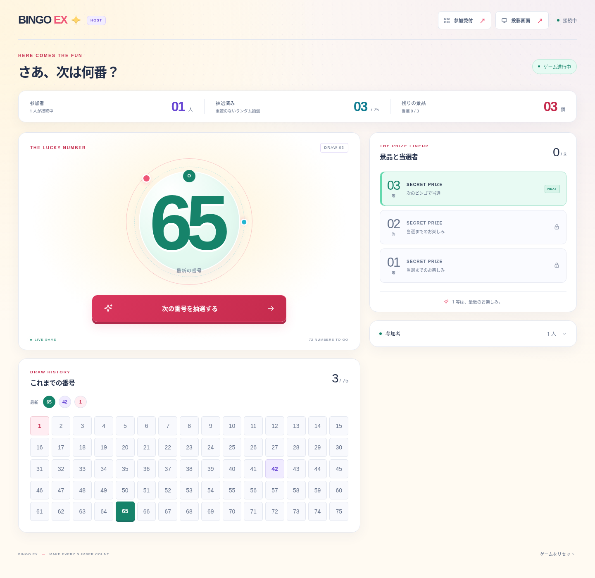
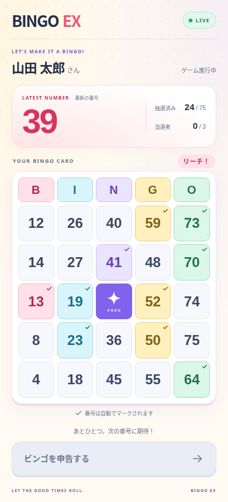
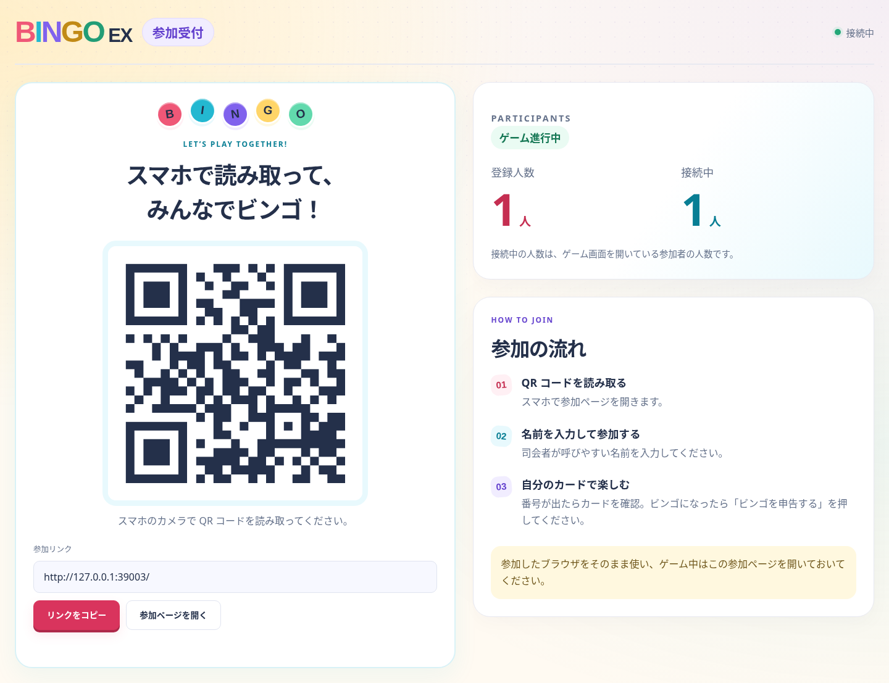
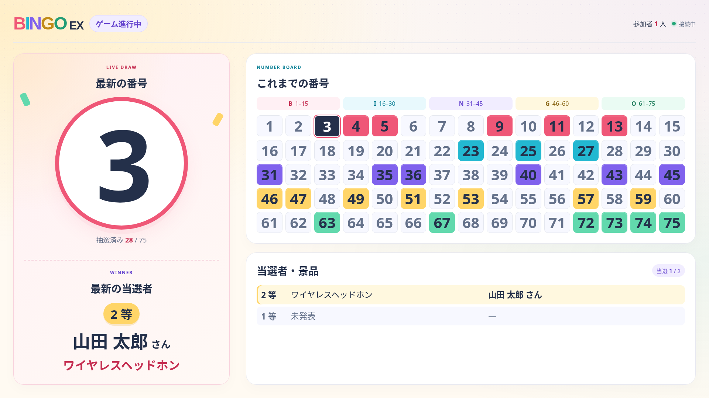

# BingoEx (リアルタイム・ウェブビンゴゲーム)

BingoExは、参加者全員がブラウザから参加できるリアルタイムのオンラインビンゴゲームシステムです。
ホスト（主催者）が番号を抽選し、プレイヤー（参加者）の画面にリアルタイムで反映される仕組みを構築しています。

## 主な機能

### ホスト（主催者）向け機能
- **2 段階のセットアップ**: 景品数を決定した後、**景品名をテキストで入力する画面**に遷移します。
- **抽選演出**: 「抽選！」ボタンを押すと約2秒間の数字シャッフルアニメーションの後、抽選結果が表示されます。
- **景品のサプライズ表示**: 未当選の景品は「？？？」と表示され、当選した瞬間に景品名が明らかになります。
- **当選順の逆転**: 下位等（例: 10等）から順に当選し、**1等が最後**に確定する盛り上がる進行順序です。
- **当選モーダル**: プレイヤーが当選するたびにホスト画面中央に **景品名** と **当選者名** を大きく表示。
- **抽選機能**: 重複しない1〜75までの番号をランダムに抽選。
- **結果出力**: 当選者リストを **CSV ダウンロード** または **テキストコピー** で出力可能。
- **リセット機能**: ゲームをリセットすると全参加者が名前入力画面に強制リダイレクトされ、再登録が必要になります。

### プレイヤー（参加者）向け機能
- **名前入力で簡単参加**: UUID を localStorage に保存するだけの気軽な参加方式。
- **ビンゴカードの自動生成**: 参加時に標準の 5x5 ビンゴカード（中央は FREE）を自動生成。
- **リアルタイム同期と判定**: 抽選結果が即座に反映され、ビンゴになれば「ビンゴを申告する」ボタンから主催者に通知。
- **景品の通知**: 当選時に自分が獲得した景品名がポップアップで表示されます。
- **不正防止**: ゲーム中は退出・名前変更不可。ビンゴの成立はサーバー側で検証されます。

### セキュリティ
- サーバー側でビンゴの成立を検証（クライアントの自己申告は不可）
- トークン認証によるなりすまし防止
- ゲーム中の名前変更ロック
- 連打防止のクールダウン機構

## 技術スタック

### フロントエンド (Client)
- **ライブラリ/フレームワーク**: React 19, Vite 6
- **ルーティング**: React Router v7
- **デザイン・UI**: モダンWebデザイン（CSS3, CSS Variables, アニメーション対応）
- **通信**: Socket.IO Client 4

### バックエンド (Server)
- **環境**: Node.js
- **フレームワーク**: Express 5
- **リアルタイム通信**: Socket.IO 4
- **その他**: `uuid`（プレイヤー識別用）, `cors`

## ディレクトリ構造

```text
BingoEx/
 ├─ client/                       # フロントエンド (React + Vite)
 │  ├─ src/
 │  │  ├─ App.jsx                 # ルーター設定
 │  │  ├─ HostDashboard.jsx       # ホスト画面 (/host)
 │  │  ├─ PlayerJoin.jsx          # プレイヤー参加画面 (/)
 │  │  ├─ PlayerGame.jsx          # プレイヤーゲーム画面 (/game)
 │  │  ├─ socket.js               # Socket接続管理
 │  │  ├─ main.jsx
 │  │  └─ styles.css
 │  ├─ index.html
 │  ├─ vite.config.js
 │  └─ package.json
 ├─ server/                       # バックエンド (Node.js + Express)
 │  ├─ index.js                   # サーバーメイン処理
 │  └─ package.json
 ├─ deploy/                       # デプロイ関連
 │  ├─ setup-conoha.sh            # ConoHa VPS ワンショットセットアップ
 │  ├─ update.sh                  # アプリ更新スクリプト
 │  └─ nginx-bingoex.conf         # Nginx 設定テンプレート
 ├─ docs/
 │  └─ hosting-guide.md           # 開催手順ガイド
 ├─ ecosystem.config.cjs          # PM2 設定
 └─ package.json                  # ルート (ビルド/起動スクリプト)
```

## 環境構築と起動方法

### ローカル開発

Node.js 22 (LTS推奨) がインストールされていることを確認してください。

```bash
# サーバー起動 (ターミナル 1)
cd server
npm install
npm run dev

# クライアント起動 (ターミナル 2)
cd client
npm install
npm run dev
```

- サーバー: `http://localhost:3001`
- クライアント: `http://localhost:5173` (Vite dev server、Socket.IO は自動プロキシ)

### 会場用の画面

- `/reception`: 参加用URLのQRコードと登録人数・接続人数を表示する受付画面。
- `/display`: 最新の抽選番号、抽選履歴、発表済みの景品と当選者を表示する投影専用画面。

ホスト画面からそれぞれ別タブで開けます。会場用の画面から抽選やリセットは操作できません。QRコードはアプリ内で生成し、未発表の景品名や参加者のカード・認証情報は会場画面に送りません。

### 再接続とカード

同じURL・同じブラウザで参加者IDとトークンが残っていれば、通信断やページの再読み込み後も同じカードに戻ります。当選済みの状態と景品名も復元します。参加要求が重複しても、同じ接続には同じカードを返します。

サーバー再起動やゲームリセットで参加情報が失われた場合は、新しいカードを自動発行せず案内を表示します。主催者に確認してから名前入力に戻り、参加し直してください。別ブラウザ・別端末での新規参加やブラウザの保存データ消去後は、元の参加情報を復元できません。

ゲーム状態は引き続きメモリ内で管理します。当日は単一のサーバープロセスを動かし、開催中の再起動・デプロイは避けてください。申告した順に下位等から景品を割り当てるルールはそのままです。

### 検証

リポジトリのルートで `npm test` を実行すると、独立したサーバーを起動し、カードの二重発行防止、再接続、当選情報の復元、会場用データと操作権限を検証します。起動中の大会の状態には触れません。画面のビルドは `npm run build` で確認できます。

### 画面のプレビュー

以下は検証用データで撮影した画面です。画像内の参加リンク・QRコードは開発環境用です。

参加受付:



司会画面:



参加者画面:



受付画面:



投影画面（当選発表）:



[抽選演出のデモ動画](docs/screenshots/draw-demo.mp4)

### 本番デプロイ (ConoHa VPS)

ワンショットセットアップスクリプトで自動構築できます。詳細は [開催手順ガイド](docs/hosting-guide.md) を参照してください。

```bash
export DOMAIN="bingo.example.com"
export HOST_PASSWORD="好きなパスワード"
bash deploy/setup-conoha.sh
```

## 遊び方

1. **ホスト画面を開く**: プロジェクター等に `/host` を表示します。
2. **景品数の設定**: 景品の数（例: 10）を入力します。
3. **景品名の入力**: 1 等から順に景品名をテキストで入力します。空欄の場合は「景品 N」が自動設定されます。
4. **ゲーム開始**: 「ゲーム開始」ボタンで抽選画面へ遷移します。
5. **参加者の参加**: 参加者は各々の端末からトップページにアクセスし、名前を入力して参加します。
6. **抽選**: ホスト画面の「抽選！」ボタンをクリックすると、約2秒間の演出アニメーションの後に番号が確定します。
7. **当選の流れ**: ビンゴになった参加者が「ビンゴを申告する」を押すと、サーバーがビンゴを検証し、ホスト画面に当選者と景品名がモーダルで表示されます。当選は**下位等から順**に確定し、1等が最後になります。
8. **景品の表示**: 未当選の景品は「？？？」と表示され、当選した瞬間に景品名が明らかになります。
9. **終了**: 全景品が確定するとゲームは自動的に終了し、結果サマリーが表示されます。CSV ダウンロードやテキストコピーで当選者リストを出力できます。
10. **リセット**: リセットすると全参加者が名前入力画面に戻り、新しいゲームは名前の再登録から始まります。

## ゲームフェーズ

サーバーは以下の4フェーズで状態を管理します:

```
setup → prizeInput → playing → finished
  景品数設定  景品名入力   抽選中      終了
```

- `setup`: 景品数を決定
- `prizeInput`: 景品名をテキスト入力
- `playing`: 抽選と当選の処理。当選は `prizeIndex = prizeCount - 1 - winnersCount` で下位等から割り当て
- `finished`: 全景品確定。結果の出力が可能。リセットで `setup` に戻る（全プレイヤー強制退出）
